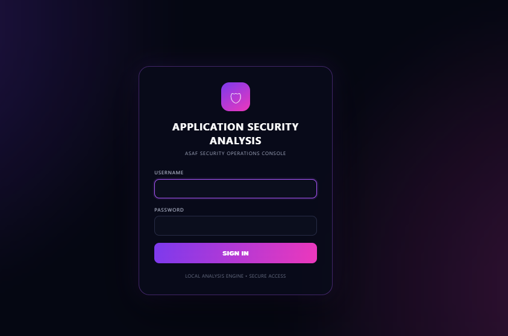
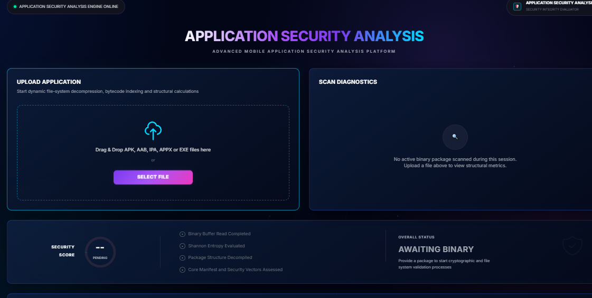
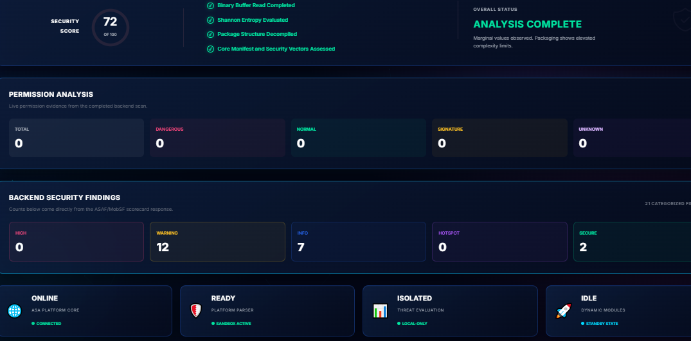
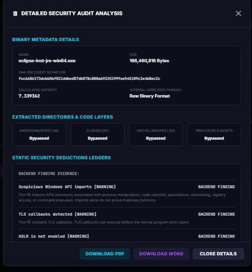

# Application Security Analysis (ASAF)

## Project Overview

Application Security Analysis (ASAF) is a web-based application security analysis framework designed to analyze applications and identify potential security issues.

The system provides a simple and modern interface for uploading applications, performing security analysis, viewing security findings, calculating a security score, and generating a professional security assessment report.

This project is developed for educational and academic purposes to demonstrate the concepts of application security analysis and automated security assessment.

---

## Objectives

The main objectives of the Application Security Analysis (ASAF) project are:

- To analyze application packages for potential security issues.
- To perform static application security analysis.
- To identify security findings and classify their severity.
- To analyze application permissions and configuration.
- To provide a security risk assessment.
- To generate a security score.
- To maintain application scan history.
- To generate a professional PDF security report.
- To provide a web-based interface for security analysis.

---

## Features

- Application file upload
- APK, AAB, IPA, APPX and EXE file support
- Static security analysis
- Application information analysis
- Package structure analysis
- AndroidManifest.xml analysis
- Permission analysis
- Security findings detection
- Severity classification
- Security score generation
- Risk classification
- Scan history
- Database storage
- Web-based dashboard
- Detailed security audit
- PDF security report generation
- Word report generation
- Remediation recommendations

---

## User Interface

The Application Security Analysis (ASAF) provides a modern web-based interface for application security analysis.

The interface allows users to access the application, upload files, monitor the analysis process, view security findings, check the security score, and inspect detailed security audit information.

### 1. Login Page

The ASAF login page provides secure access to the Application Security Analysis platform.



---

### 2. Application Security Dashboard

The dashboard provides the main interface for uploading an application and starting the security analysis process.

Users can upload an application file using the file upload section and monitor the analysis status through the dashboard.



---

### 3. Security Analysis Results

After the analysis is completed, the dashboard displays the security score, analysis status, permission analysis, and categorized security findings.

The interface provides different categories such as High, Warning, Info, Hotspot, and Secure findings.



---

### 4. Detailed Security Audit

The detailed security audit interface provides additional information about the analyzed application.

It displays binary metadata, extracted directories and code layers, and security findings identified during the analysis.

The interface also provides options to download the generated security report.



---

## Technologies Used

| Technology | Purpose |
|---|---|
| Python | Backend programming |
| Django | Web framework |
| HTML | Web page structure |
| CSS | User interface styling |
| JavaScript | Frontend functionality |
| SQLite | Database |
| Git | Version control |
| GitHub | Source code repository |

---

## System Workflow

```text
              ┌─────────────────────┐
              │   Upload Application│
              └──────────┬──────────┘
                         │
                         ▼
              ┌─────────────────────┐
              │ Application Analysis│
              └──────────┬──────────┘
                         │
                         ▼
              ┌─────────────────────┐
              │ Static Security     │
              │ Analysis            │
              └──────────┬──────────┘
                         │
                         ▼
              ┌─────────────────────┐
              │ Security Findings   │
              └──────────┬──────────┘
                         │
                         ▼
              ┌─────────────────────┐
              │ Risk Assessment     │
              └──────────┬──────────┘
                         │
                         ▼
              ┌─────────────────────┐
              │ Security Score      │
              └──────────┬──────────┘
                         │
                         ▼
              ┌─────────────────────┐
              │ Generate Security   │
              │ Report              │
              └─────────────────────┘